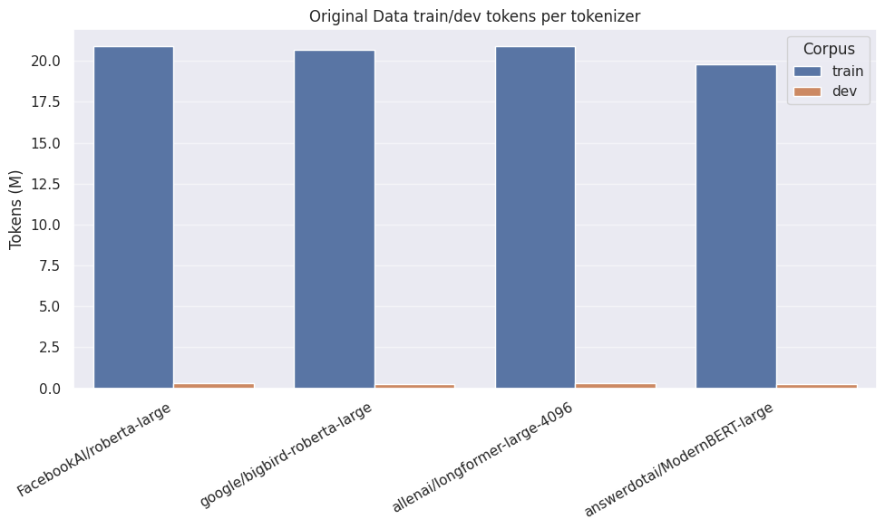
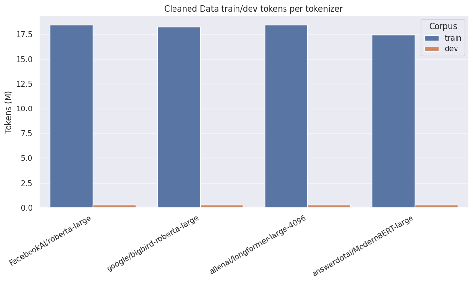

## Report the Domain Adaptation Setup

### Data

* Original Corpus




* Cleaned Corpus



---

### Bidirectional LMs

#### FacebookAI/roberta-large

```bash
## config
CUDA_VISIBLE_DEVICES=0 python3 run_mlm_attn.py \
    --model_name_or_path FacebookAI/roberta-large \
    --mlm_probability 0.15 \
    --train_file original_corpus/train.csv \ # cleaned_corpus/train.csv
    --validation_file original_corpus/dev.csv \ # cleaned_corpus/dev.csv
    --output_dir model_hub/roberta-large-original \ # -cleaned
    --learning_rate 3e-5 \
    --warmup_ratio 0.05 \
    --weight_decay 0.01 \
    --max_grad_norm 1.0 \
     --max_seq_length 512 \
      --num_train_epochs 3 \
      --dataloader_num_workers 4 \
       --per_device_train_batch_size 16 \
       --per_device_eval_batch_size 8 \
       --gradient_accumulation_steps 2 \
         --save_strategy "epoch" \
         --logging_steps 100 \
         --seed 42 \
           --evaluation_strategy "epoch" \
           --do_train=True \
            --do_eval=True \
             --report_to "none" \
             --overwrite_output_dir
```

##### Original Corpus

| Num Examples | Num Epochs | Total Train/Eval Batch Size | Optimization Steps | Trainable Parameters |
|--------------|------------|-----------------------------|--------------------|----------------------|
| 41,028       | 3          | 32/16                       | 3,846              | 355,412,057          |

##### Cleaned Corpus

| Num Examples | Num Epochs | Total Train/Eval Batch Size | Optimization Steps | Trainable Parameters |
|--------------|------------|-----------------------------|--------------------|----------------------|
| 36,330       | 3          | 32/16                       | 3,405              | 355,412,057          |

---

#### google/bigbird-roberta-large

```bash
CUDA_VISIBLE_DEVICES=0 python3 run_mlm_attn.py \
    --model_name_or_path google/bigbird-roberta-large \
    --mlm_probability 0.15 \
    --train_file original_corpus/train.csv \ # cleaned_corpus/train.csv
    --validation_file original_corpus/dev.csv \ # cleaned_corpus/dev.csv
    --output_dir model_hub/bigbird-roberta-large-original \ # -cleaned
    --learning_rate 3e-5 \
    --warmup_ratio 0.05 \
    --weight_decay 0.01 \
    --max_grad_norm 1.0 \
     --max_seq_length 512 \
      --num_train_epochs 3 \
      --dataloader_num_workers 4 \
       --per_device_train_batch_size 16 \
       --per_device_eval_batch_size 8 \
       --gradient_accumulation_steps 2 \
         --save_strategy "epoch" \
         --logging_steps 100 \
         --seed 42 \
           --evaluation_strategy "epoch" \
           --do_train=True \
            --do_eval=True \
             --report_to "none" \
             --overwrite_output_dir
```    

##### Original Corpus

| Num Examples | Num Epochs | Total Train/Eval Batch Size | Optimization Steps | Trainable Parameters |
|--------------|------------|-----------------------------|--------------------|----------------------|
| 40,546       | 3          | 32/16                       | 3,801              | 360,225,974          |

##### Cleaned Corpus

| Num Examples | Num Epochs | Total Train/Eval Batch Size | Optimization Steps | Trainable Parameters |
|--------------|------------|-----------------------------|--------------------|----------------------|
| 35,885       | 3          | 32/16                       | 3,364              | 360,225,974          |

---

#### allenai/longformer-large-4096

```bash
CUDA_VISIBLE_DEVICES=0 python3 run_mlm_attn.py \
    --model_name_or_path allenai/longformer-large-4096 \
    --mlm_probability 0.15 \
    --train_file original_corpus/train.csv \ # cleaned_corpus/train.csv
    --validation_file original_corpus/dev.csv \ # cleaned_corpus/dev.csv
    --output_dir model_hub/longformer-large-original \ # -cleaned
    --learning_rate 3e-5 \
    --warmup_ratio 0.05 \
    --weight_decay 0.01 \
    --max_grad_norm 1.0 \
     --max_seq_length 512 \
      --num_train_epochs 3 \
      --dataloader_num_workers 4 \
       --per_device_train_batch_size 16 \
       --per_device_eval_batch_size 8 \
       --gradient_accumulation_steps 2 \
         --save_strategy "epoch" \
         --logging_steps 100 \
         --seed 42 \
           --evaluation_strategy "epoch" \
           --do_train=True \
            --do_eval=True \
             --report_to "none" \
             --overwrite_output_dir
```    

##### Original Corpus

| Num Examples | Num Epochs | Total Train/Eval Batch Size | Optimization Steps | Trainable Parameters |
|--------------|------------|-----------------------------|--------------------|----------------------|
| 41,028       | 3          | 32/16                       | 3,846              | 434,653,273          |

##### Cleaned Corpus

| Num Examples | Num Epochs | Total Train/Eval Batch Size | Optimization Steps | Trainable Parameters |
|--------------|------------|-----------------------------|--------------------|----------------------|
| 36,330       | 3          | 32/16                       | 3,405              | 434,653,273          |

---

#### answerdotai/ModernBERT-large

```bash
CUDA_VISIBLE_DEVICES=0 python3 run_mlm_attn.py \
    --model_name_or_path answerdotai/ModernBERT-large \
    --mlm_probability 0.15 \
    --train_file original_corpus/train.csv \ # cleaned_corpus/train.csv
    --validation_file original_corpus/dev.csv \ # cleaned_corpus/dev.csv
    --output_dir model_hub/modernBERT-large-original \ # -cleaned
    --learning_rate 3e-5 \
    --warmup_ratio 0.05 \
    --weight_decay 0.01 \
    --max_grad_norm 1.0 \
     --max_seq_length 512 \
      --num_train_epochs 3 \
      --dataloader_num_workers 4 \
       --per_device_train_batch_size 16 \
       --per_device_eval_batch_size 8 \
       --gradient_accumulation_steps 2 \
         --save_strategy "epoch" \
         --logging_steps 100 \
         --seed 42 \
           --eval_strategy "epoch" \
           --do_train=True \
            --do_eval=True \
             --report_to "none" \
             --overwrite_output_dir
```

##### Original Corpus

| Num Examples | Num Epochs | Total Train/Eval Batch Size | Optimization Steps | Trainable Parameters |
|--------------|------------|-----------------------------|--------------------|----------------------|
| 38,907       | 3          | 32/16                       | 3,648              | 395,881,664          |

##### Cleaned Corpus

| Num Examples | Num Epochs | Total Train/Eval Batch Size | Optimization Steps | Trainable Parameters |
|--------------|------------|-----------------------------|--------------------|----------------------|
| 34,336       | 3          | 32/16                       | 3,219              | 395,881,664          |


---